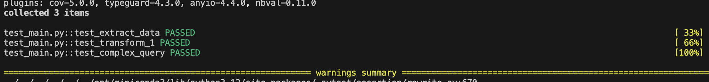
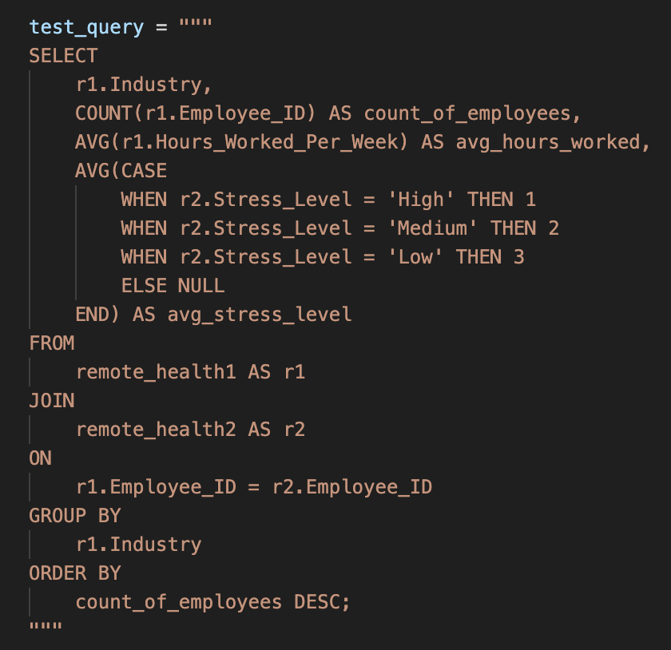
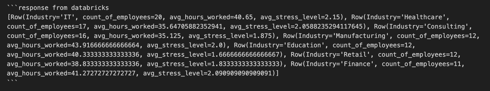
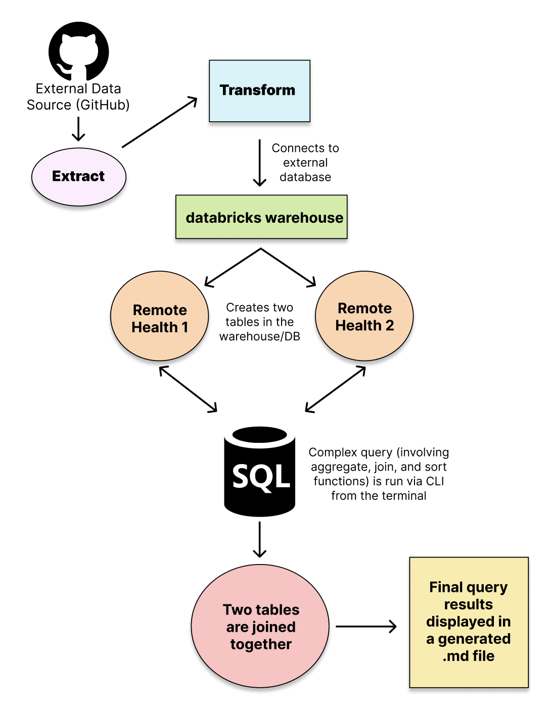

# Python Script interacting with SQL Database
#### The purpose of this project is to perform ETL functions on a csv file, connect to an external database (databricks), and perform a complex query that includes joins, aggregation, and sorting

#### Requirements:

- [X] Connect to a SQL database in databricks
- [X] Design a complex SQL query involving joins, aggregation, and sorting
- [X] Provide an explanation for what the query is doing and the expected results
- [X] CI/CD pipeline
- [X] Written or video explanation of the query
- [X] README.md
- [X] Use CLI

---
### Folder Navigation
##### Here is a quick overview of how the folders are structured for this project:
---
- Project Folder
    - .devcontainer
        - devcontainer.json
        - Dockerfile
    - .github
        - workflows
            - main.yml
    - data
        - Table 1 csv file
        - Table 2 csv file
    - SQL_files
        - complex_query.py
        - extract.py
        - transform.py
    - ETL_complex_diagram (arch diagram screenshot)
    - main.py
    - make_test_results (screenshot of local tests)
    - Makefile
    - query_image.png (screenshot of .md log results)
    - query_log.md (markdown that logs all queries made)
    - README.md
    - requirements.txt
    - test_main.py
---
### Workflow Summary and Explanation
##### This project contains the following dependencies:
- pylint == 2.15.3
- black == 22.3.0
- pytest == 7.1.3
- ruff == 0.0.284
- fire == 0.7.0
- requests == 2.32.3
- pandas == 2.2.2
- python-dotenv == 1.0.1
- databricks-sql-connector == 3.4.0
---
### What is the Purpose of this Project?
##### The purpose of this project is to perform an ETL and a complex query by connecting to an external database. To set up data for the join, I downloaded a public dataset from Kaggle, that collected information about remote work and its impacts on mental health conditions and stress levels. I split this data into two separate files, one with demographics and job information, and one with the health statistics collected. The data was then passed as a url through an extract function to return two file paths. 

##### Next, a connection with the databricks warehouse was established, and the data was transformed/cleaned and loaded as two tables (remote_health1 and remote_health2) into the database. 

##### Finally, after the tables are successfully loaded into the database, any type of query can be performed to explore the data. 

___
### What is the Goal of the Query?
##### In this project, the complex query I ran can be seen in the query_log.md file, or in the screenshot below. I first took the count of how many employees were in the dataset, then found the average number of hours worked per week overall. From there, I found the average number of hours worked per week, grouped by stress level(Low, Medium, or High). Then, I joined the two tables together using an automatic inner merge, where the Employee ID number of Table 1 matched that of Table 2. Finally, I grouped it by industry, and then ordered the data by the Employee ID number in descending order.

##### Query (Reformatted from the makefile):

##### Result:

##### Table of Results
|   Industry    | Count of Employees | Average Hours Worked | Average Stress Level |
|---------------|--------------------|----------------------|----------------------|
| IT            |         20         |        40.65         |         2.15         |
| Healthcare    |         17         |        35.65         |         2.06         |
| Consulting    |         16         |        35.13         |         1.88         |
| Manufacturing |         12         |        43.92         |          2.0         |
| Education     |         12         |        40.33         |         1.67         |
| Retail        |         12         |        38.83         |         1.83         |
| Finance       |         11         |        41.27         |         2.09         |

##### This table displays the results in a more visual way, grouped by industry. We are able to directly compare the number of employees in each industry, the average hours worked per week, and the average stress level reported (1=low, 3=high).

### Integrating CLI Tools 
##### To make this project accessible from the terminal, I created a Command Line Tool (CLI) to be able to run the project with simple commands. In the main.py file, I utilized the argparse package to create the CLI, which lets the user choose between three actions: "extract," "transform," and "complex_query." The arguments function parses the CLI arguments, with the "complex_query" action requiring an additional query argument. This is where you would input any query of your choice into the makefile. The main function executes the appropriate action based on the user's input: extracting data, transforming data, or running a complex query. Depending on the action, it calls specific functions (extract_data, transform_1, transform_2, complex_query). Finally, the script runs the main function if executed as the main module.
___
### Arch Diagram 
##### The following diagram displays a flowchart of how ETL process works in this project. As explained above, the data is extracted from an external source (GitHub url), then transformed. The transform function connects to an external database/warehouse in databricks, and the payload from the csv files are loaded into two tables. Finally, a CLI tool performs a complex query to join the two tables, find the averages of hours worked per week based on stress level, and groups and sort the data by employee ID and industry. The results are displayed in a generated markdown file titled query_log.md.

